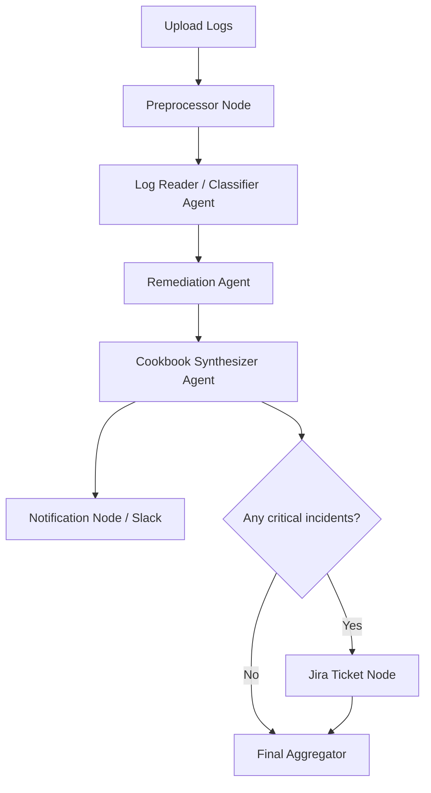

# Multi-Agent DevOps Incident Analysis Suite

Hackathon starter for a **multi-agent incident response app** that ingests operational logs, analyzes them with specialized AI agents, and returns actionable remediation steps for DevOps/SRE teams.

---

## 🚀 What this project is about

Based on the hackathon brief in `docs/`, the goal is to build a system that can:

- accept uploaded ops logs
- parse and classify incidents
- suggest likely remediation steps
- generate a step-by-step operator cookbook
- notify a Slack channel
- create Jira tickets for **critical** issues

The recommended orchestration layer is **LangGraph**, with a lightweight UI built in **FastAPI** or **Streamlit**.

---

## 🧠 Proposed multi-agent workflow

1. **Log Reader / Classifier Agent**  
   Parses raw logs, extracts fields, categorizes incidents, and assigns severity.

2. **Remediation Agent**  
   Maps each incident to likely root causes and recommended fixes.

3. **Cookbook Synthesizer Agent**  
   Converts remediation advice into a practical incident-response checklist.

4. **Notification Node**  
   Sends a Slack-ready summary to an incoming webhook.

5. **Jira Ticket Node**  
   Creates a Jira ticket only when an incident is marked `critical`.

6. **Final Aggregator**  
   Returns structured results to the UI/API.

---

## 🏗️ Suggested MVP scope

A simple first version should include:

- one-page UI for file upload
- an **Analyze Logs** action
- parsed incidents and severities
- remediation suggestions
- cookbook checklist output
- Slack delivery status
- Jira status for critical incidents

---

## 🛠️ Tech stack

- **Python 3.12**
- **uv** for dependency and virtual environment management
- **FastAPI** or **Streamlit** for the app/UI
- **LangGraph** for orchestration
- **Pydantic** for structured models
- **OpenAI-compatible LLMs** for reasoning
- **Slack incoming webhooks** for notifications
- **Jira REST API** for ticket creation
- **SQLite / JSON** for local run history

---

## 📁 Project structure

```text
multi-agent/
├── docs/                    # hackathon brief and proposal
├── src/multi_agent/         # starter Python package
├── .env.example             # environment variable template
├── .gitignore
├── .python-version
├── pyproject.toml           # uv-managed project configuration
└── README.md
```

---

## ⚡ Getting started with `uv`

### 1) Install `uv`

On Windows PowerShell:

```powershell
powershell -ExecutionPolicy ByPass -c "irm https://astral.sh/uv/install.ps1 | iex"
```

Alternative:

```powershell
pip install uv
```

> `uv` was not detected in the current environment, so run one of the install commands above first.

### 2) Sync the project environment

```powershell
uv sync --dev
```

This will create `.venv/` and install the runtime + dev dependencies from `pyproject.toml`.

### 3) Add local environment variables

```powershell
Copy-Item .env.example .env
```

Then fill in the values for:

- `OPENAI_API_KEY`
- `SLACK_WEBHOOK_URL`
- `JIRA_BASE_URL`
- `JIRA_EMAIL`
- `JIRA_API_TOKEN`

### 4) Run the starter scaffold

```powershell
uv run multi-agent-suite
```

---

## 📌 Common `uv` commands

| Task | Command |
|---|---|
| Install dependencies | `uv sync --dev` |
| Add a runtime package | `uv add <package>` |
| Add a dev package | `uv add --dev <package>` |
| Run the starter app | `uv run multi-agent-suite` |
| Run tests | `uv run pytest` |
| Lint the codebase | `uv run ruff check .` |
| Auto-fix lint issues | `uv run ruff check . --fix` |

---

## 🔄 Recommended implementation flow

1. Create a minimal upload UI in `FastAPI` or `Streamlit`.
2. Define Pydantic models for incidents, remediations, and cookbook steps.
3. Build LangGraph nodes for:
   - preprocessing
   - log classification
   - remediation generation
   - cookbook synthesis
   - Slack notification
   - conditional Jira ticket creation
4. Persist run history in SQLite or JSON.
5. Add tests for parsing, severity rules, and notification formatting.

---

## 🧭 High-level architecture



---

## ✅ Current setup added

The repo now includes:

- `pyproject.toml` configured for **uv**
- a starter package in `src/multi_agent/`
- `.env.example` for local configuration
- `.python-version` pinned to Python `3.12`
- updated developer onboarding instructions in this `README.md`
