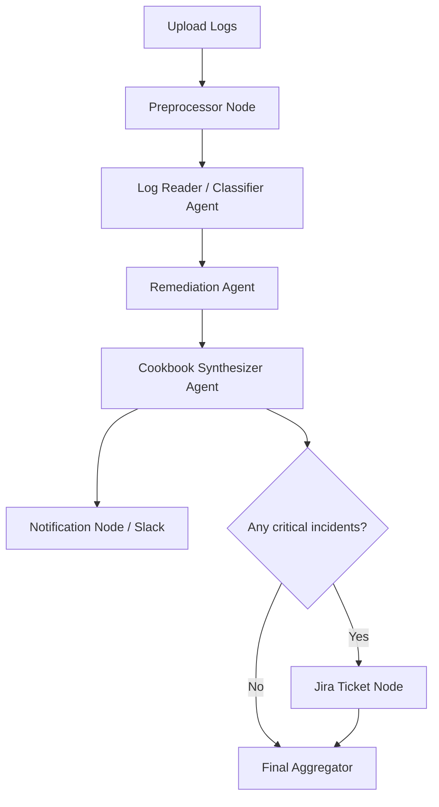

# Multi-Agent DevOps Incident Analysis Suite

Hackathon project for ingesting operational logs, analyzing incidents, generating remediation guidance, and exposing results through a backend API and a Streamlit frontend.

## What is in the repo

- `src/`: backend application code and package entrypoints
- `frontend/`: Streamlit incident-analysis console
- `tests/`: automated tests
- `docs/`: hackathon brief and related docs
- `pyproject.toml`: single shared `uv` project configuration for the entire repo

## Stack

- Python 3.12+
- `uv` for dependency and environment management
- FastAPI for the backend API
- Streamlit for the frontend
- LangGraph and LLM integrations for analysis workflows

## Setup

1. Install `uv`.

Windows PowerShell:

```powershell
powershell -ExecutionPolicy ByPass -c "irm https://astral.sh/uv/install.ps1 | iex"
```

Alternative:

```powershell
pip install uv
```

2. From the project root, sync the shared environment:

```powershell
uv sync --dev
```

3. Create local env vars:

```powershell
Copy-Item .env.example .env
```

Populate the values you need, including:

- `OPENAI_API_KEY`
- `SLACK_WEBHOOK_URL`
- `JIRA_BASE_URL`
- `JIRA_EMAIL`
- `JIRA_API_TOKEN`

## Running the project

Everything runs from the project root and uses the single root `.venv`.

Backend API:

```powershell
uv run uvicorn src.multi_agent.api.main:app --reload
```

Frontend:

```powershell
uv run streamlit run frontend/app.py
```

Starter package entrypoint:

```powershell
uv run multi-agent-suite
```

## Frontend notes

- Default mode is `mock`, which uses local sample payloads from `frontend/utils/mock_data.py`
- Switch to `live` in the Streamlit sidebar to call the backend at `http://localhost:8000`
- The frontend uses a shared API client abstraction so mock and live modes do not change the UI code
- Session state keeps the selected run and fetched payloads available across pages

Frontend pages:

- Home / Dashboard
- Upload and Analyze
- Incident Explorer
- Cookbook
- Timeline and Root Cause
- Workflow Graph
- Artifacts and Export
- Integrations
- Runs History

## Common uv commands

| Task | Command |
|---|---|
| Sync dependencies | `uv sync --dev` |
| Add a runtime dependency | `uv add <package>` |
| Add a dev dependency | `uv add --dev <package>` |
| Run the backend | `uv run uvicorn src.multi_agent.api.main:app --reload` |
| Run the frontend | `uv run streamlit run frontend/app.py` |
| Run tests | `uv run pytest` |
| Run Ruff | `uv run ruff check .` |
| Auto-fix Ruff issues | `uv run ruff check . --fix` |

## Architecture


